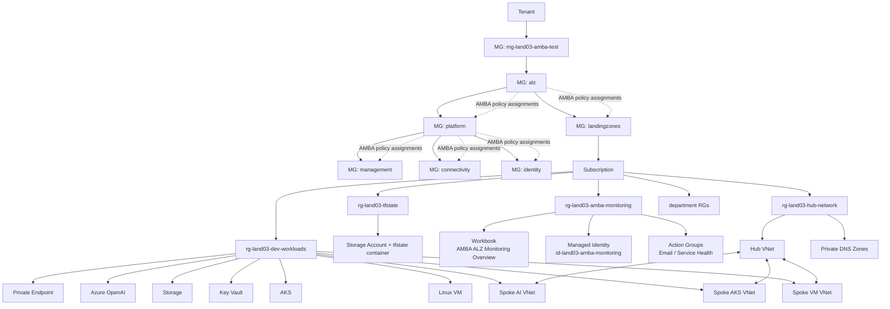

# Azure Landing Zone Test03 + AMBA ALZ 통합 구성

이 저장소는 Azure Landing Zone 실습 구성을 단계별 Terraform으로 배포하고, `1.5-amba-alz-monitoring` 단계에서 **AMBA ALZ(Azure Monitor Baseline Alerts for Azure Landing Zones)** 모니터링 정책을 추가하는 예제입니다.

## 전체 구성도



## 전체 적용 순서

```text
0-bootstrap
1-org
1.5-amba-alz-monitoring
2-environments
3-networks-hub-and-spoke
4-projects
5-app-infra
```

| Stage | Directory | 역할 |
|---|---|---|
| 0 | `0-bootstrap` | Terraform state 저장용 Resource Group, Storage Account, Container 생성 |
| 1 | `1-org` | 예산, 기본 Azure Policy Definition/Assignment 생성 |
| 1.5 | `1.5-amba-alz-monitoring` | AMBA ALZ Management Group 구조, Policy Assignment, Workbook, Action Group 구성 |
| 2 | `2-environments` | Hub, Dev, 부서별 Resource Group 생성 |
| 3 | `3-networks-hub-and-spoke` | Hub/Spoke VNet, Subnet, Private DNS, Peering 생성 |
| 4 | `4-projects` | 프로젝트 카탈로그 정보를 Terraform state/output으로 기록 |
| 5 | `5-app-infra` | VM, AKS, Storage, Key Vault, Azure OpenAI, Private Endpoint 생성 |

## 사전 준비

```bash
terraform version
az version
az login
az account show
```

배포 계정에는 다음 권한이 필요합니다.

- 대상 Subscription Owner 또는 동등 권한
- Management Group 생성/수정 권한
- Management Group 범위 Policy Assignment 및 Role Assignment 권한
- VM, AKS, VNet, Storage, Key Vault, Cognitive Services 생성 권한

## 1. 저장소 준비

```bash
git clone https://github.com/sonmap/Azure-landing-zone_test03_AMBA_ALZ.git
cd Azure-landing-zone_test03_AMBA_ALZ
```

## 2. Subscription ID 치환

현재 Azure CLI가 바라보는 구독 ID를 사용합니다.

```bash
export SUBSCRIPTION_ID=$(az account show --query id -o tsv)
echo "$SUBSCRIPTION_ID"
```

CSV와 tfvars 파일의 `<SUBSCRIPTION_ID>`를 치환합니다. `.terraform` 디렉터리는 제외합니다.

```bash
find . \
  -path "*/.terraform" -prune -o \
  \( -name "*.csv" -o -name "terraform.tfvars" -o -name "*.tfvars" \) \
  -type f -print0 \
| xargs -0 sed -i "s/<SUBSCRIPTION_ID>/${SUBSCRIPTION_ID}/g"
```

## 3. 실행 전 필수 값 수정

아래 값은 실제 환경에 맞게 바꿔야 합니다.

```text
<ADMIN_PUBLIC_IP>/32
owner@example.com
REPLACE_WITH_SECURE_PASSWORD
```

주요 파일:

```text
1-org/csv/org_config.csv
1.5-amba-alz-monitoring/terraform.tfvars.example
3-networks-hub-and-spoke/csv/network_config.csv
5-app-infra/csv/app_config.csv
```

`terraform.tfvars.example`을 복사해서 실제 입력 파일을 만듭니다.

```bash
cp 1.5-amba-alz-monitoring/terraform.tfvars.example \
   1.5-amba-alz-monitoring/terraform.tfvars
```

`1.5-amba-alz-monitoring/terraform.tfvars`에서 이메일을 수정합니다.

```hcl
action_group_email = [
  "your-email@example.com"
]

enable_sms_action_group     = true
sms_action_group_name       = "ag-land03-amba-email"
sms_action_group_short_name = "ambaemail"
sms_action_group_email_receivers = [
  "your-email@example.com"
]
```

## 4. AMBA 테스트 Management Group 생성

운영 Management Group에 바로 적용하지 말고 테스트용 Management Group을 먼저 만듭니다.

```bash
MG_ID="mg-land03-amba-test"
SUB_ID=$(az account show --query id -o tsv)

az account management-group create \
  --name "$MG_ID" \
  --display-name "land03 AMBA Test"
```

`1.5-amba-alz-monitoring`은 `mg-land03-amba-test` 아래에 다음 AMBA ALZ 계층을 만듭니다.

```text
mg-land03-amba-test
└── alz
    ├── platform
    │   ├── management
    │   ├── connectivity
    │   └── identity
    └── landingzones
```

AMBA 정책을 실습 구독에 적용하려면 최종적으로 구독이 `landingzones` 아래에 있어야 합니다.

```bash
az account management-group subscription add \
  --name landingzones \
  --subscription "$SUB_ID"
```

처음 실행 전에는 `landingzones`가 아직 없을 수 있습니다. 그 경우 `1.5-amba-alz-monitoring`을 먼저 적용한 뒤 위 구독 이동 명령을 실행하고, `1.5-amba-alz-monitoring`을 다시 적용합니다.

## 5. 검증

모든 stage의 문법을 먼저 확인합니다.

```bash
for d in \
  0-bootstrap \
  1-org \
  1.5-amba-alz-monitoring \
  2-environments \
  3-networks-hub-and-spoke \
  4-projects \
  5-app-infra; do
  echo "### $d"
  terraform -chdir="$d" init -backend=false -input=false
  terraform -chdir="$d" validate
done
```

## 6. 단계별 배포

각 stage는 `init -> plan -> apply` 순서로 실행합니다.

### 6.1 0-bootstrap

```bash
terraform -chdir=0-bootstrap init
terraform -chdir=0-bootstrap plan -out=tfplan
terraform -chdir=0-bootstrap apply tfplan
```

### 6.2 1-org

```bash
terraform -chdir=1-org init
terraform -chdir=1-org plan -out=tfplan
terraform -chdir=1-org apply tfplan
```

### 6.3 1.5-amba-alz-monitoring

```bash
terraform -chdir=1.5-amba-alz-monitoring init
terraform -chdir=1.5-amba-alz-monitoring plan -out=tfplan
terraform -chdir=1.5-amba-alz-monitoring apply tfplan
```

AMBA 계층 생성 후 구독을 `landingzones` 아래로 이동합니다.

```bash
SUB_ID=$(az account show --query id -o tsv)

az account management-group subscription add \
  --name landingzones \
  --subscription "$SUB_ID"
```

구독 이동 후 `1.5`를 한 번 더 적용해서 Policy Assignment와 Role Assignment를 수렴시킵니다.

```bash
terraform -chdir=1.5-amba-alz-monitoring plan -out=tfplan
terraform -chdir=1.5-amba-alz-monitoring apply tfplan
```

### 6.4 2-environments

```bash
terraform -chdir=2-environments init
terraform -chdir=2-environments plan -out=tfplan
terraform -chdir=2-environments apply tfplan
```

### 6.5 3-networks-hub-and-spoke

```bash
terraform -chdir=3-networks-hub-and-spoke init
terraform -chdir=3-networks-hub-and-spoke plan -out=tfplan
terraform -chdir=3-networks-hub-and-spoke apply tfplan
```

### 6.6 4-projects

```bash
terraform -chdir=4-projects init
terraform -chdir=4-projects plan -out=tfplan
terraform -chdir=4-projects apply tfplan
```

### 6.7 5-app-infra

```bash
terraform -chdir=5-app-infra init
terraform -chdir=5-app-infra plan -out=tfplan
terraform -chdir=5-app-infra apply tfplan
```

## 7. 배포 확인

Management Group 구조:

```bash
az account management-group show \
  --name mg-land03-amba-test \
  --expand \
  --recurse \
  -o json
```

AMBA Policy Assignment:

```bash
for mg in alz platform landingzones management connectivity identity; do
  echo "### $mg"
  az policy assignment list \
    --scope "/providers/Microsoft.Management/managementGroups/$mg" \
    -o table
done
```

Action Group:

```bash
az monitor action-group list \
  --resource-group rg-land03-amba-monitoring \
  -o table
```

Alert Rule:

```bash
az monitor metrics alert list -o table
az monitor scheduled-query list -o table
```

Workbook:

```text
Azure Portal
-> Monitor
-> Workbooks
-> AMBA ALZ Monitoring Overview
```

또는:

```text
Azure Portal
-> Resource groups
-> rg-land03-amba-monitoring
-> a15f0000-0000-4000-8000-000000000001
```

## 8. AMBA 주의사항

- AMBA Policy Assignment는 Management Group 범위에 생성됩니다. Subscription 범위에서만 보면 안 보일 수 있습니다.
- Azure Portal에서 Policy Assignment를 볼 때 Scope를 `alz`, `platform`, `landingzones`, `management`, `connectivity`, `identity` Management Group으로 바꿔 확인합니다.
- `DeployIfNotExists` 정책은 기존 리소스에 대해 remediation이 필요할 수 있습니다.
- VM Guest OS 메모리/디스크 사용률은 Azure Monitor Agent, VM Insights, Log Analytics 수집 구성이 필요합니다.
- 리소스별 AMBA 제외가 필요하면 `MonitorDisable=true` 태그를 사용합니다.

## 9. 삭제 순서

생성 순서의 역순으로 삭제합니다.

```bash
terraform -chdir=5-app-infra destroy
terraform -chdir=4-projects destroy
terraform -chdir=3-networks-hub-and-spoke destroy
terraform -chdir=2-environments destroy
terraform -chdir=1.5-amba-alz-monitoring destroy
terraform -chdir=1-org destroy
terraform -chdir=0-bootstrap destroy
```
