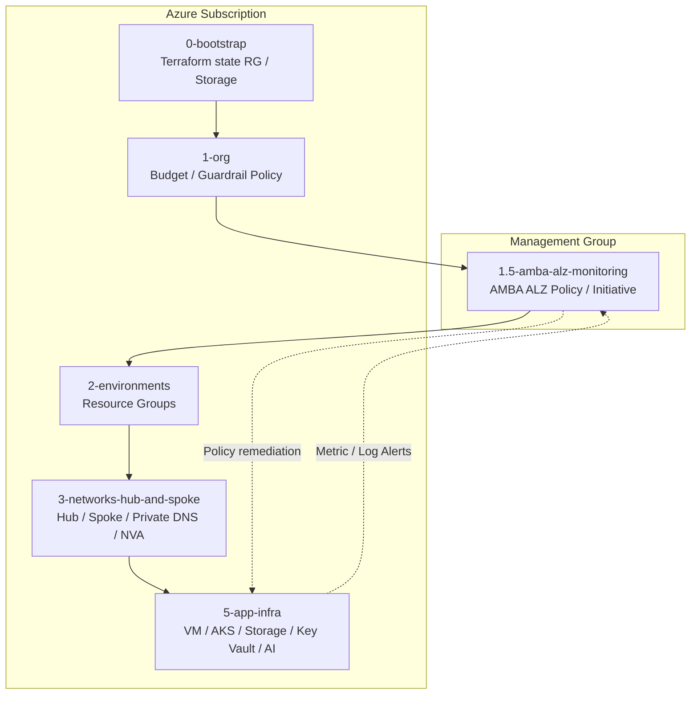

# Azure Landing Zone Test03 + AMBA ALZ

This repository is an integrated Terraform lab for **Azure Landing Zone Test03** with an added **AMBA ALZ monitoring stage**.

AMBA ALZ means:

```text
Azure Monitor Baseline Alerts + Azure Landing Zones
```

It deploys Azure Monitor baseline alert policies at Management Group scale by using Azure Policy / Initiative / DeployIfNotExists patterns.

## Integrated deployment order

```text
0-bootstrap
1-org
1.5-amba-alz-monitoring
2-environments
3-networks-hub-and-spoke
4-projects
5-app-infra
```

## Architecture summary



## Stage layout

| Stage | Directory | Purpose |
|---|---|---|
| 0 | `0-bootstrap` | Creates Terraform state resource group, storage account, and container. |
| 1 | `1-org` | Creates subscription budgets and basic guardrail Azure Policy assignments. |
| 1.5 | `1.5-amba-alz-monitoring` | Deploys AMBA ALZ Management Group scoped monitoring policy pattern. |
| 2 | `2-environments` | Creates platform, workload, and department resource groups. |
| 3 | `3-networks-hub-and-spoke` | Creates hub VNet, spoke VNets, subnets, route tables, private DNS, NSG, and hub NVA VM. |
| 4 | `4-projects` | Records workload project catalog outputs/state. |
| 5 | `5-app-infra` | Creates workload VM, private AKS, Storage, Key Vault, Azure OpenAI, AI Foundry, and Private Endpoint. |

## Prerequisites

```bash
terraform version
az version
az login
az account show
```

The deployment identity needs:

- Owner or equivalent on the target subscription.
- Permission to create policy assignments and role assignments.
- Management Group permission for the AMBA ALZ stage.
- Permission to create VM, AKS, VNet, Storage, Key Vault, Cognitive Services, and Machine Learning resources.

## Configure subscription IDs

Most stages are CSV-driven. Replace placeholders such as `<SUBSCRIPTION_ID>`, `<DEV_SUBSCRIPTION_ID>`, `owner@example.com`, and `REPLACE_WITH_SECURE_PASSWORD` before applying.

Important CSV files:

```text
0-bootstrap/csv/bootstrap_config.csv
1-org/csv/org_config.csv
1-org/csv/policy_assignments.csv
1.5-amba-alz-monitoring/terraform.tfvars.example
2-environments/csv/resource_groups.csv
3-networks-hub-and-spoke/csv/network_config.csv
3-networks-hub-and-spoke/csv/networks.csv
3-networks-hub-and-spoke/csv/subnets.csv
3-networks-hub-and-spoke/csv/routes.csv
5-app-infra/csv/app_config.csv
5-app-infra/csv/aks_clusters.csv
5-app-infra/csv/ai_services.csv
5-app-infra/csv/vm_workloads.csv
```

## AMBA ALZ Management Group test setup

Create a test Management Group and attach only the lab subscription first.

```bash
MG_ID="mg-land03-amba-test"
SUB_ID="<SUBSCRIPTION_ID>"

az account management-group create \
  --name "$MG_ID" \
  --display-name "land03 AMBA Test"

az account management-group subscription add \
  --name "$MG_ID" \
  --subscription "$SUB_ID"
```

## Validate all stages

```bash
for d in \
  0-bootstrap \
  1-org \
  1.5-amba-alz-monitoring \
  2-environments \
  3-networks-hub-and-spoke \
  4-projects \
  5-app-infra; do
  echo "### $d"
  terraform -chdir="$d" init -backend=false -input=false
  terraform -chdir="$d" validate
done
```

## Deploy

Run in order:

```bash
terraform -chdir=0-bootstrap init
terraform -chdir=0-bootstrap plan -out=tfplan
terraform -chdir=0-bootstrap apply tfplan

terraform -chdir=1-org init
terraform -chdir=1-org plan -out=tfplan
terraform -chdir=1-org apply tfplan

terraform -chdir=1.5-amba-alz-monitoring init
terraform -chdir=1.5-amba-alz-monitoring plan -out=tfplan
terraform -chdir=1.5-amba-alz-monitoring apply tfplan

terraform -chdir=2-environments init
terraform -chdir=2-environments plan -out=tfplan
terraform -chdir=2-environments apply tfplan

terraform -chdir=3-networks-hub-and-spoke init
terraform -chdir=3-networks-hub-and-spoke plan -out=tfplan
terraform -chdir=3-networks-hub-and-spoke apply tfplan

terraform -chdir=4-projects init
terraform -chdir=4-projects plan -out=tfplan
terraform -chdir=4-projects apply tfplan

terraform -chdir=5-app-infra init
terraform -chdir=5-app-infra plan -out=tfplan
terraform -chdir=5-app-infra apply tfplan
```

## Verify AMBA

```bash
az policy assignment list \
  --scope "/providers/Microsoft.Management/managementGroups/mg-land03-amba-test" \
  -o table

az policy state summarize \
  --management-group mg-land03-amba-test \
  -o table

az monitor metrics alert list -o table
az monitor scheduled-query list -o table
```

## Important lab notes

- Do not apply AMBA ALZ directly to a production Management Group first.
- Use a dedicated test Management Group and one lab subscription.
- AKS `loadBalancer` outbound may create a public IP in the managed resource group; keep deny-public-IP policy disabled for the lab if needed.
- Guest OS memory and filesystem disk usage require Azure Monitor Agent / VM Insights / Log Analytics collection.
- Disable AMBA monitoring per resource by applying a tag such as `MonitorDisable=true`.

## Destroy order

```bash
terraform -chdir=5-app-infra destroy
terraform -chdir=4-projects destroy
terraform -chdir=3-networks-hub-and-spoke destroy
terraform -chdir=2-environments destroy
terraform -chdir=1.5-amba-alz-monitoring destroy
terraform -chdir=1-org destroy
terraform -chdir=0-bootstrap destroy
```
