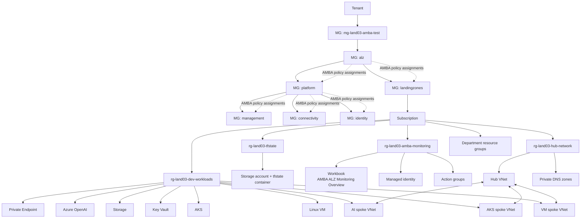

# Azure Landing Zone Test03 + AMBA ALZ

This repository is an integrated Terraform lab for **Azure Landing Zone Test03** with an added **AMBA ALZ** monitoring stage.

AMBA ALZ means:

```text
Azure Monitor Baseline Alerts for Azure Landing Zones
```

It deploys Azure Monitor baseline alert policies at Management Group scope by using Azure Policy, initiatives, and `DeployIfNotExists` patterns.

## Architecture




## Deployment Order

```text
0-bootstrap
1-org
1.5-amba-alz-monitoring
2-environments
3-networks-hub-and-spoke
4-projects
5-app-infra
```

| Stage | Directory | Purpose |
|---|---|---|
| 0 | `0-bootstrap` | Creates the Terraform state resource group, storage account, and container. |
| 1 | `1-org` | Creates budgets and base guardrail policy definitions/assignments. |
| 1.5 | `1.5-amba-alz-monitoring` | Creates AMBA ALZ Management Group scoped monitoring policy assignments, workbook, managed identity, and action groups. |
| 2 | `2-environments` | Creates hub, dev, and department resource groups. |
| 3 | `3-networks-hub-and-spoke` | Creates hub/spoke VNets, subnets, private DNS zones, and peerings. |
| 4 | `4-projects` | Records the workload project catalog as Terraform outputs/state. |
| 5 | `5-app-infra` | Creates VM, AKS, Storage, Key Vault, Azure OpenAI, and Private Endpoint resources. |

## Prerequisites

```bash
terraform version
az version
az login
az account show
```

The deployment identity needs:

- Owner or equivalent permission on the target subscription.
- Permission to create and update Management Groups.
- Permission to create policy assignments and role assignments at Management Group scope.
- Permission to create VM, AKS, VNet, Storage, Key Vault, Cognitive Services, and Machine Learning resources.

## 1. Clone

```bash
git clone https://github.com/sonmap/Azure-landing-zone_test03_AMBA_ALZ.git
cd Azure-landing-zone_test03_AMBA_ALZ
```

## 2. Replace Subscription Placeholders

```bash
export SUBSCRIPTION_ID=$(az account show --query id -o tsv)
echo "$SUBSCRIPTION_ID"
```

```bash
find . \
  -path "*/.terraform" -prune -o \
  \( -name "*.csv" -o -name "terraform.tfvars" -o -name "*.tfvars" \) \
  -type f -print0 \
| xargs -0 sed -i "s/<SUBSCRIPTION_ID>/${SUBSCRIPTION_ID}/g"
```

## 3. Configure Required Values

Replace the following placeholders before applying:

```text
<ADMIN_PUBLIC_IP>/32
owner@example.com
REPLACE_WITH_SECURE_PASSWORD
```

Important files:

```text
1-org/csv/org_config.csv
1.5-amba-alz-monitoring/terraform.tfvars.example
3-networks-hub-and-spoke/csv/network_config.csv
5-app-infra/csv/app_config.csv
```

Create the AMBA tfvars file:

```bash
cp 1.5-amba-alz-monitoring/terraform.tfvars.example \
   1.5-amba-alz-monitoring/terraform.tfvars
```

Update email receivers in `1.5-amba-alz-monitoring/terraform.tfvars`:

```hcl
action_group_email = [
  "your-email@example.com"
]

enable_sms_action_group     = true
sms_action_group_name       = "ag-land03-amba-email"
sms_action_group_short_name = "ambaemail"
sms_action_group_email_receivers = [
  "your-email@example.com"
]
```

## 4. Create the Test Management Group

Create a dedicated test Management Group first.

```bash
MG_ID="mg-land03-amba-test"
SUB_ID=$(az account show --query id -o tsv)

az account management-group create \
  --name "$MG_ID" \
  --display-name "land03 AMBA Test"
```

The AMBA stage creates this hierarchy under `mg-land03-amba-test`:

```text
mg-land03-amba-test
└── alz
    ├── platform
    │   ├── management
    │   ├── connectivity
    │   └── identity
    └── landingzones
```

The lab subscription should be placed under `landingzones`:

```bash
az account management-group subscription add \
  --name landingzones \
  --subscription "$SUB_ID"
```

If `landingzones` does not exist yet, apply `1.5-amba-alz-monitoring` once, move the subscription, and apply `1.5-amba-alz-monitoring` again.

## 5. Validate

```bash
for d in \
  0-bootstrap \
  1-org \
  1.5-amba-alz-monitoring \
  2-environments \
  3-networks-hub-and-spoke \
  4-projects \
  5-app-infra; do
  echo "### $d"
  terraform -chdir="$d" init -backend=false -input=false
  terraform -chdir="$d" validate
done
```

## 6. Deploy

Run every stage in order with `init`, `plan`, and `apply`.

```bash
terraform -chdir=0-bootstrap init
terraform -chdir=0-bootstrap plan -out=tfplan
terraform -chdir=0-bootstrap apply tfplan
```

```bash
terraform -chdir=1-org init
terraform -chdir=1-org plan -out=tfplan
terraform -chdir=1-org apply tfplan
```

```bash
terraform -chdir=1.5-amba-alz-monitoring init
terraform -chdir=1.5-amba-alz-monitoring plan -out=tfplan
terraform -chdir=1.5-amba-alz-monitoring apply tfplan
```

After the AMBA hierarchy exists, move the subscription under `landingzones` and converge the AMBA stage again:

```bash
SUB_ID=$(az account show --query id -o tsv)

az account management-group subscription add \
  --name landingzones \
  --subscription "$SUB_ID"

terraform -chdir=1.5-amba-alz-monitoring plan -out=tfplan
terraform -chdir=1.5-amba-alz-monitoring apply tfplan
```

```bash
terraform -chdir=2-environments init
terraform -chdir=2-environments plan -out=tfplan
terraform -chdir=2-environments apply tfplan
```

```bash
terraform -chdir=3-networks-hub-and-spoke init
terraform -chdir=3-networks-hub-and-spoke plan -out=tfplan
terraform -chdir=3-networks-hub-and-spoke apply tfplan
```

```bash
terraform -chdir=4-projects init
terraform -chdir=4-projects plan -out=tfplan
terraform -chdir=4-projects apply tfplan
```

```bash
terraform -chdir=5-app-infra init
terraform -chdir=5-app-infra plan -out=tfplan
terraform -chdir=5-app-infra apply tfplan
```

## 7. Verify

Management Group hierarchy:

```bash
az account management-group show \
  --name mg-land03-amba-test \
  --expand \
  --recurse \
  -o json
```

AMBA policy assignments:

```bash
for mg in alz platform landingzones management connectivity identity; do
  echo "### $mg"
  az policy assignment list \
    --scope "/providers/Microsoft.Management/managementGroups/$mg" \
    -o table
done
```

Action Groups:

```bash
az monitor action-group list \
  --resource-group rg-land03-amba-monitoring \
  -o table
```

Alert rules:

```bash
az monitor metrics alert list -o table
az monitor scheduled-query list -o table
```

Workbook:

```text
Azure Portal -> Monitor -> Workbooks -> AMBA ALZ Monitoring Overview
```

Or open the workbook resource in:

```text
Resource groups -> rg-land03-amba-monitoring
```

## Important Notes

- AMBA policy assignments are created at Management Group scope. They may not appear when the Azure Portal Policy scope is set only to the subscription.
- In Azure Portal, change Policy Assignment scope to `alz`, `platform`, `landingzones`, `management`, `connectivity`, or `identity`.
- `DeployIfNotExists` policies may require remediation for existing resources.
- Guest OS memory and filesystem usage require Azure Monitor Agent, VM Insights, and Log Analytics collection.
- Disable AMBA monitoring per resource with the `MonitorDisable=true` tag.

## Destroy Order

```bash
terraform -chdir=5-app-infra destroy
terraform -chdir=4-projects destroy
terraform -chdir=3-networks-hub-and-spoke destroy
terraform -chdir=2-environments destroy
terraform -chdir=1.5-amba-alz-monitoring destroy
terraform -chdir=1-org destroy
terraform -chdir=0-bootstrap destroy
```
